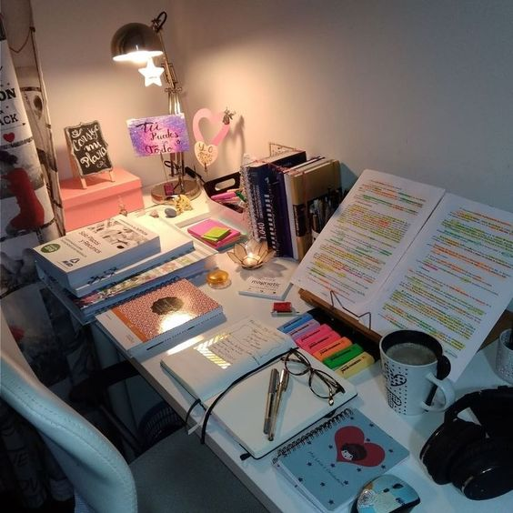

<html>
<head>
<meta name="viewport" content="width=device-width, initial-scale=1">

</head>
  

 

  <a href="https://ami-az.github.io/study.html">
  

    
Study

  

  

  <a href="https://ami-az.github.io/study.html">
  

    
Lifestyle

  

